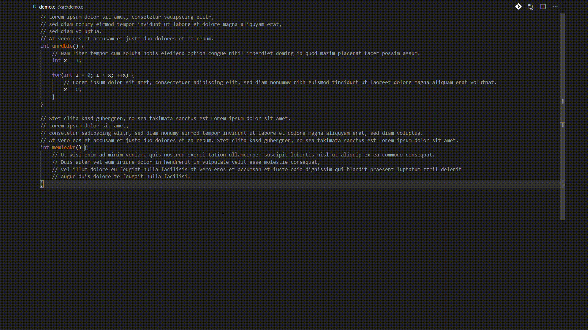
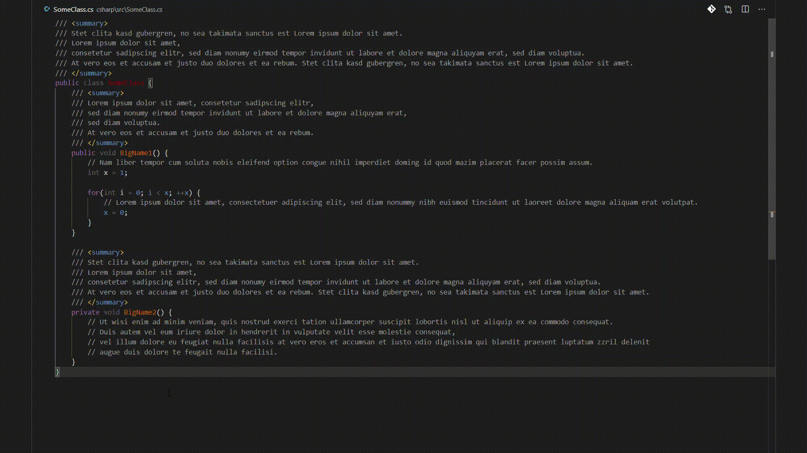
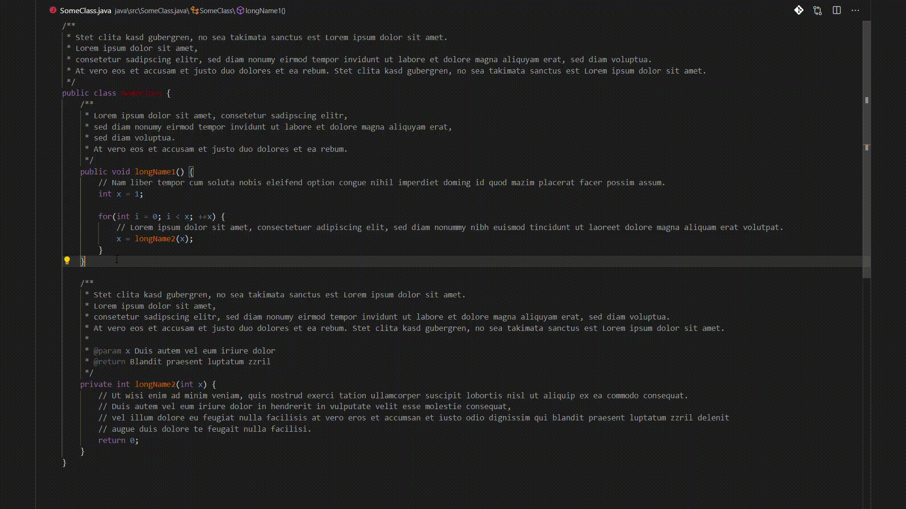

# UniComments README

A vscode extension that aims to improve the readability of source code by unifying the max line length of comments.

## Features

## Extension Settings

This extension contributes the following settings:

* `unicomments.commentLineLength`: Maximum allowed length for a line within a comment (if possible).
* `unicomments.commentLineStarters`: Lines are recognized as comments when they start with any of the defined strings in this array (leading whitespaces are ignored).

## Extension Hotkeys

These are the hotkeys that can be set for this extension:

* `unicomments.unify-selection`: The default hotkey is `ctrl+k g` (`cmd+k g` on mac)
* `unicomments.unify-document`: The default hotkey is `ctrl+k ctrl+g` (`cmd+k cmd+g` on mac)

## Known Issues

None yet.

## Release Notes

### 1.0.0-alpha.0

Initial release with basic functionality. Works as expected but requires some testing. Use at own risk.

## Planned Features

* Setting to define an array of strings that will cause a comment line to be ignored by this extension if the line starts with any of the strings within the defined array (leading whitespaces and the comment starter literal are ignored).

-----------------------------------------------------------------------------------------------------------

&copy; HDainester
